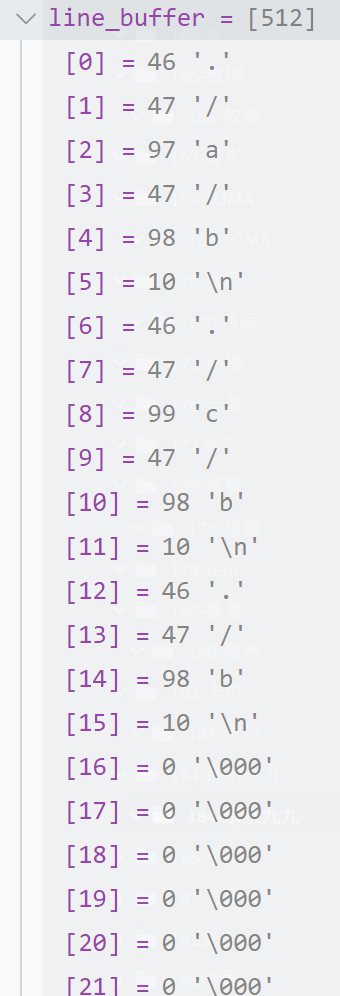

#  Lab1: Xv6 and Unix utilities

花费时间：15h（算上林林总总搭建环境的时间吧）

## Sleep(难度：Easy)

没什么难度。只要搞懂argc，argv的概念，同时搞懂用户态和内核态调用的函数实际上是不一样的就行了

最开始写的时候搞了半天，发现不知道怎么调用sleep。后面才知道user.h和sysproc.h里面的函数虽然名字一样但是属于不同的态。在这个里面只需要调用用户函数就行了

```c
#include "kernel/types.h"
#include "kernel/stat.h"
#include "user/user.h"

int main(int argc, char* argv[])
{
    if (argc != 2) {
        fprintf(2, "Usage: sleep seconds...\n");
        exit(1);
    }

    uint ticks = atoi(argv[1]);
    sleep(ticks);

    exit(0);
};
```

##  pingpong（难度：Easy）

不难。参考实验指导书的管线部分。注意以下几点

* 一个管道只能单方向读写。pingpong需要创建两个管道
* 创建管道后记得即时关闭读口或者输出口
* 文件描述符和管道之间的区别和关联

```c
#include "kernel/types.h"
#include "kernel/stat.h"
#include "user/user.h"

int main(int argc, char* argv[])
{
    if (argc != 1)
        fprintf(2, "Usage: pingpong...\n");

    int ping_pipe[2];    // parent to child,0 read child,1 write parent
    int pong_pipe[2];    // child to parent,0 read parent,1 write child
    pipe(ping_pipe);
    pipe(pong_pipe);

    if (fork() == 0) {
        close(ping_pipe[1]);
        close(pong_pipe[0]);

        close(0);
        dup(ping_pipe[0]);

        char* ptr = 0;
        read(0, ptr, 1);
        close(ping_pipe[0]);

        fprintf(2, "%d: received ping\n", getpid());
        write(pong_pipe[1], ptr, 1);
        close(pong_pipe[1]);
    }
    else {
        close(ping_pipe[0]);
        close(pong_pipe[1]);

        char ch = 'z';
        write(ping_pipe[1], &ch, 1);
        close(ping_pipe[1]);

        char* ptr2 = 0;
        read(pong_pipe[0], ptr2, 1);
        close(pong_pipe[0]);

        fprintf(2, "%d: received pong\n", getpid());
    }

    exit(0);
};
```

##  Primes(素数，难度：Moderate/Hard)

暂时没什么思路。

* 卡住的点在于
  * 创建子进程的逻辑
  * 如何处理管线在父子进程之间的通信

边看ai给的提示边写。其中写错了一次，一直生成到了63个进程才停止。发现是没有结束相关进程。

这道题的主要思路的父进程将数字交给子进程之后，就关闭管道开始wait。所有子进程共用一个逻辑。概括一下递归的三步
* 退出条件：读取到的第一个数不是整数，是EOF（end of file），说明所有的数都被处理完了
* 处理逻辑：创建一个管道，继续创建一个子进程。处理数字，根据处理逻辑将剩下的数送到管道的输出端。由于在创建子进程的时候会和父进程进行管道上的处理，因此只管将数字输出去就行了
* 递归条件：子进程带着新开的管道

感觉重点还是在于不太能够处理清楚管道和进程之间的关系吧。只有一对父子还好，但是考虑到递归的情况就很难搞的清楚

```c
#include "kernel/types.h"
#include "kernel/stat.h"
#include "user/user.h"

// #define MAX_NUM = 36

void prime(int read_p, int write_p)
{
    close(write_p);
    int n = 0;
    if (read(read_p, &n, 4) == sizeof(n)) {
        fprintf(1, "prime %d\n", n);
    }
    else {
        close(read_p);
        exit(0);
    }

    int new_p[2];
    pipe(new_p);

    if (fork() == 0) {
        prime(new_p[0], new_p[1]);
        exit(0);
    }
    else {
        close(new_p[0]);

        int p = 0;
        while (read(read_p, &p, 4) == sizeof(p)) {
            if (p % n != 0)
                write(new_p[1], &p, 4);
        }
        close(read_p);
        close(new_p[1]);
        wait(0);
        exit(0);
    }
}

int main(int argc, char* argv[])
{
    int p[2];
    pipe(p);

    if (fork() == 0) {
        // close(p[1]);
        prime(p[0], p[1]);
        wait(0);
    }
    else {
        close(p[0]);
        for (int i = 2; i < 36; i++) {
            write(p[1], (int*)&i, 4);
        }
        close(p[1]);
        wait(0);
    }

    exit(0);
};
```

## find（难度：Moderate）

卡了一个早上。先是看了很多ls的代码，然后在基础上改，也是磕磕碰碰改出来了。写一个两个主要卡住的点
#### 两个主要结构体
一开始被卡在的地方在于完全不能够理解unix系统中的路径和文件存放方式。主要查看struct dirent和struct stat。
* struct dirent
  * 代表了目录中的一个条目 (Directory Entry)
  * inum 字段存储的是该目录项指向的文件或子目录的 Inode 号
  * name 字段是一个字符数组，用来存储该目录项对应的文件或子目录的名称。
  * 例子
    * 目录文件 /home/user/mydir 的内容被分成了多个 16 字节大小的块。
    * 第一个 16 字节块就是一个 struct dirent。它的 inum 字段是 100，name 字段存储了 "myfile.txt"，后面用 null 字符 \0 填充到 14 字节。
    * 第二个 16 字节块是另一个 struct dirent。它的 inum 字段是 200，name 字段存储了 "mysubdir"，后面也用 null 填充。
    * 后续的 16 字节块可能是空闲的目录项。在这种简单的文件系统中，当一个文件或目录被删除时，它对应的 dirent 条目并不会被物理移除，而是将其 inum 设置为 0（通常 0 号 Inode 是保留的或无效的），表示这个槽位是空的，可以被新的目录项复用。
* struct stat
  * 一个 C 语言结构体定义，它用来存储关于一个文件或目录的各种元数据
  * ```int dev```。 dev 字段表示文件所属的文件系统所在的磁盘设备
  * ```uint ino```。 ino 字段表示文件的 Inode 号
  * ```short type```。type 字段表示文件的类型。这个字段的值就是上面定义的 T_DIR、T_FILE 或 T_DEVICE 之一，用来告诉你这个 stat 结构体描述的是一个目录、普通文件还是设备文件。
  * ```short nlink```。nlink 字段表示指向该文件的 硬链接数 (Number of Hard Links)。它统计有多少个不同的目录项（文件名）指向同一个 Inode（也就是同一个文件）。对于一个普通文件，这个值至少是 1。对于目录，它至少是 2（一个来自父目录中的名字，一个来自目录本身内部的 . 条目）。
  * ```uint64 size```。size 字段表示文件的大小，单位是字节。
因此在代码的while循环里面，实现了对当前目录下所有文件和目录的读取。de.name存储获取到的文件或者目录的名字，并将其添加到buf缓冲区中。buf缓冲区存放的就是当前目录的完整路径。

#### 对于路径所在的字符串的操作

* 犯错包括
  * 将```strcmp```打错为了```strcpy```。
  * strlen是不包括结尾的\0
  * 忘记了怎么创建c语言的字符串
* 需要学习
  * memmove，memset的相关用法
  * C语言字符串基础

```c
#include "kernel/types.h"
#include "kernel/stat.h"
#include "user/user.h"
#include "kernel/fs.h"

void find(char* path, const char* filename)
{
    char          buf[512];
    char*         p;
    int           fd;
    struct dirent de;
    struct stat   st;

    // open a fild
    if ((fd = open(path, 0)) < 0) {
        fprintf(2, "find: cannot open %s\n", path);
        return;
    }
    // store info to st
    if (fstat(fd, &st) < 0) {
        fprintf(2, "find: cannot stat %s\n", path);
        close(fd);
        return;
    }

    switch (st.type) {
        case T_FILE:
            if (strcmp(de.name, filename) == 0)
                printf("%s\n", path);
            break;

        case T_DIR:
            if (strlen(path) + 1 + DIRSIZ + 1 > sizeof buf) {
                printf("find: path too long\n");
                break;
            }

            // update current path
            strcpy(buf, path);
            p = buf + strlen(buf);
            *p++ = '/';    // buf:  ./

            while (read(fd, &de, sizeof(de)) == sizeof(de)) {
                if (de.inum == 0)
                    continue;
                memmove(p, de.name, DIRSIZ);
                p[DIRSIZ] = 0;
                if (stat(buf, &st) < 0) {
                    printf("find: cannot stat %s\n", buf);
                    continue;
                }
                /*------- core code ---------*/
                if (st.type == T_DIR) {    // if dir,find in dir recursively
                    if (strcmp(de.name, ".") != 0 && strcmp(de.name, "..") != 0) {
                        // char subpath[strlen(buf) + 1];
                        // memmove(subpath, buf, strlen(buf));
                        // subpath[strlen(buf)] = 0;
                        // find(subpath, filename);
                        find(buf, filename);
                    }
                }
                else if (st.type == T_FILE) {    // if file,print
                    if (strcmp(de.name, filename) == 0)
                        printf("%s\n", buf);
                }
                /*------- core code ---------*/
            }
            break;
    }
    close(fd);
}

int main(int argc, char* argv[])
{
    if (argc < 3)
        fprintf(1, "Usage: find [dir] [file ...]\n");

    for (int i = 2; i < argc; i++)
        find(argv[1], argv[i]);

    exit(0);
};
```

## xargs（难度：Moderate）

差不多写了一个晚上。
这道题倒是不是特别难，但是有几个地方没有搞清楚
* shell里面两个进程之间管道的通信。主要去看sh.c里面的那一个部分，搞清楚左端将输出输入到管道，右端通过标准输入读取管道里面的数据
* main函数里面的argv和argc参数到底是什么东西。虽然觉得知道但是在这道题的一开始还是不知道具体是什么，debug了一下才搞清楚，是xargs及其后面带的东西。因此这里面的argc就是3。
* 有了上面的知识，我们就需要将左端的输出转化为新的argv参数，并且在exec调用的时候和右端旧的argv参数一起输入进去。这里又出现了很麻烦的事情。那就是需要将一行或者多行的字符数据读取并且转化为一个个的字符串再输入到argv数组中。这里就是c语言基础不扎实了。
  * 忘了二维字符串指针数组的组织形式
  * 忘了将一长串的字节读取后进行相关的转换（力扣刷过）

贴一张debug中的line_buffer的图片。一开始没写对是由于没有考虑到输出的分隔符为\n的情况。因此需要在处理逻辑的时候都考虑进去


```c
#include "kernel/types.h"
#include "kernel/stat.h"
#include "user/user.h"

#define MAXARG 32    // max exec arguments

int main(int argc, char* argv[])
{
    char* exec_argv[MAXARG];
    int   index = 0;
    for (int i = 1; i < argc; i++) {
        exec_argv[index] = argv[i];
        // printf("exec_argv: %s\n", exec_argv[index]);
        index++;
    }

    char c;
    char line_buffer[512];
    int  line_buffer_count = 0;
    while (read(0, &c, 1) == 1) {
        line_buffer[line_buffer_count] = c;
        line_buffer_count++;
    }
    line_buffer[line_buffer_count] = '\0';
    int char_pos_in_line = 0;

    while (char_pos_in_line <= line_buffer_count) {
        while (line_buffer[char_pos_in_line] == ' ') {
            char_pos_in_line++;
        }
        if (line_buffer[char_pos_in_line] == '\0')
            break;
        exec_argv[index] = &line_buffer[char_pos_in_line];
        index++;
        while (line_buffer[char_pos_in_line] != ' ' && line_buffer[char_pos_in_line] != '\0' &&
               line_buffer[char_pos_in_line] != '\n') {
            char_pos_in_line++;
        }
        if (line_buffer[char_pos_in_line] == ' ' || line_buffer[char_pos_in_line] == '\n' ||
            line_buffer[char_pos_in_line] == '\0') {
            line_buffer[char_pos_in_line] = '\0';
            char_pos_in_line++;
        }
    }

    if (fork() == 0) {
        exec(argv[1], exec_argv);
    }
    else {
        wait(0);
    }

    exit(0);
};
```

