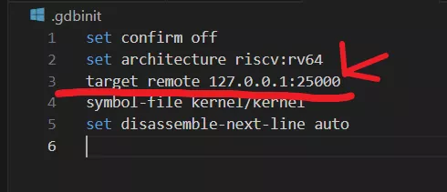
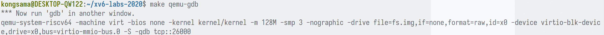

# Vscode+gdb调试设置

## Vscode设置

### 准备工作

确保能够使用```make qemu```编译xv6，并已经安装了相关的依赖，比如```gdb-multiarch```

* mit6.s081的实验环境,能够使用```make qemu```编译xv6
* ```riscv64-unknown-elf-gdb```（版本13.2，用于gdb调试，vscode调试实质上就是提供个图形化页面，底层还是这个）
  * 安装步骤见寄存器部分
<!-- ```bash
sudo apt-get install gdb-multiarch
``` -->

### 补全配置

1. 安装clangd插件（自动补全用）

<image src="./images/clangd.png" width="50%">

1. 安装```clangd```，```bear```。如果是Makefile构建的工程，可以使用bear工具帮助，在编译的时候```bear make```就可以生成```compile_commands.json``` 文件。clangd能进行代码提示和跳转，首先是开了一个cland服务器，一个重要文件就是```compile_commands.json```。这是通过make和cmake编译的时候生成的。
```bash
sudo apt-get install clangd bear
```

1. 运行```bear make qemu```。将生成的```compile_commands.json```放入到```.vscode```文件夹中。重启vscode

### 自动格式化配置

1. 安装clang-format插件（自动格式化用）

<image src="./images/format.png" width="50%">

2. 安装```clang-format```
```bash
sudo apt-get install clang-format
```

### debug配置

1. 安装C/C++插件（debug用）

<image src="./images/C++.png" width="50%">

1. 在根目录下创建```.vscode```文件夹，并创建如下内容的两个文件：```launch.json```、```tasks.json```
   *  ```launch.json```负责设置debug相关设置
      *  ```miDebuggerServerAddress```：把端口改为.gdbinit文件中的那个端口号
      *  ```miDebuggerPath```：填成自己```riscv64-unknown-elf-gdb```的位置。假如不需要vscode查看寄存器，可以直接安装```gdb-multiarch```，并换成这个
      *  ```stopAtEntry```：调试开始时是否停在入口
   *  ```tasks.json```负责设置编译相关设置
```json
//launch.json
{
  "version": "0.2.0",
  "configurations": [
    {
      "name": "debug xv6",
      "type": "cppdbg",
      "request": "launch",
      "program": "${workspaceFolder}/kernel/kernel",
      "args": [],
      "stopAtEntry": true,
      "cwd": "${workspaceFolder}",
      "miDebuggerServerAddress": "localhost:26000",
      "miDebuggerPath": "/usr/local/bin/riscv64-unknown-elf-gdb",
      "environment": [],
      "externalConsole": false,
      "MIMode": "gdb",
      "setupCommands": [
        {
          "description": "pretty printing",
          "text": "-enable-pretty-printing",
          "ignoreFailures": true
        },
        //用于VSCODE查看寄存器。生成xml步骤具体见后面
        {
          "text": "set tdesc filename regxml.xml",
        }
      ],
      "logging": {
        // "engineLogging": true,
        // "programOutput": true,
      }
    }
  ]
}
```
```json
//tasks.json
{
  "version": "2.0.0",
  "tasks": [
    {
      "label": "xv6debugbuild",
      "type": "shell",
      "isBackground": true,
      "command": "make clean && make qemu-gdb",
      "problemMatcher": [
        {
          "pattern": [
            {
              "regexp": ".",
              "file": 1,
              "location": 2,
              "message": 3
            }
          ],
          "background": {
            "beginsPattern": ".*Now run 'gdb' in another window.",
            // 要对应编译成功后,一句echo的内容. 此处对应 Makefile Line:170
            "endsPattern": "."
          }
        }
      ]
    },
    {
      "label": "xv6build", // 任务的名称
      "type": "shell", // 任务类型为 shell 命令
      "command": "make clean && make qemu", // 要执行的命令，使用 && 串联
      "options": {
        "cwd": "${workspaceFolder}" // 设置工作目录为项目根目录
      },
      "group": {
        "kind": "build", // 将此任务归类为构建任务
        "isDefault": false // 可以设置为 true 使其成为默认构建任务 (可选)
      },
      "presentation": {
        "reveal": "always", // 始终显示终端输出
        "clear": true // 每次运行前清空终端
      },
      "problemMatcher": [] // 如果不需要匹配编译器问题，可以留空
    }
  ]
}
```

1. 终端输入```make qemu```会从```.gdbinit.tmpl-riscv```生成一个```.gdbinit```
   * 修改```.gdbinit.tmpl-riscv```文件内容。将```target remote 127.0.0.1:1234```修改为```#target remote 127.0.0.1:1234```
   * 或者修改```.gdbinit```文件内容。删去```target remote 127.0.0.1:26000```（或者可能端口号为其他）
   * 

### VSCODE寄存器可视化

1. 安装```riscv64-unknown-elf-gdb```。见参考文献部分
2. F5运行情况下在调试控制台中输入-exec maintenance print xml-tdesc ，完整复制输出的内容后存放在根目录*.xml下。我取的名字为regxml.xml。（名字也可以看你喜欢修改）
3. 保存文件并结束调试，在根目录下运行make clean
4. 为launch.json添加```"text": "set tdesc filename myxml.xml"```部分
5. F5运行后发现已经安静的停在main，此时你会发现寄存器恢复了
6. 为了定制化xml，你可以修改内部结构但要遵守regnum排序，具体请自行尝试

## 调试操作

### 普通调试

1. 先 ```make clean``` 。终端输入 ```make qemu-gdb``` 。出现如下图片，说明这条 ```make qemu-gdb``` 命令的输出表示 QEMU 模拟器已经启动了内核（kernel/kernel）并暂停运行，等待您在另一个终端窗口中启动 GDB 并连接到 TCP 端口 26000 以开始调试。


2. 在xv6根目录下按下F5，会发现停在了程序入口```main```。
<image src="./images/debug-main.png" width="50%">

### 运行用户程序

1. 终端输入```make qemu-gdb```
2. 按F5进入调试，它会跳到kernel的main函数。
3. 在调试控制台，输入```-exec file user/_sleep```（这里是个例子，表示切换到sleep.c的符号表），输出```Reading symbols from user/_sleep```表示成功了。前面加上-exec表示这个gdb命令
4. 后就可以在```sleep.c```文件中打断点了，断点是红色的表示打成功了

<image src="./images/debug-sleep.png" width="50%">

## 参考文献

[MIT 6.S081 lab0：配置xv6环境+vscode调试](https://acmicpc.top/2024/02/08/MIT-6.S081-lab0-%E9%85%8D%E7%8E%AF%E5%A2%83/#%E4%BD%BF%E7%94%A8VScode-gdb%E8%B0%83%E8%AF%95)

寄存器设置部分：[在vscode上完美调试xv6指南](https://zhuanlan.zhihu.com/p/567525198)

[MIT 6.S081 xv6调试不完全指北](https://www.cnblogs.com/KatyuMarisaBlog/p/13727565.html)

[6.S081的调试和VSCode环境配置](https://www.cnblogs.com/KatyuMarisaBlog/p/13727565.html)

* ```riscv64-unknown-elf-gdb```安装
  * [清华rCore安装riscv64-unknown-elf-gdb](https://rcore-os.cn/rCore-Tutorial-deploy/docs/pre-lab/gdb.html)
  * [MIT6.S081 riscv64-unknown-elf-gdb安装指北](https://rcore-os.cn/rCore-Tutorial-deploy/docs/pre-lab/gdb.html)
  * [riscv64-unknown-elf-gdb 安装](https://blog.csdn.net/qq_45228845/article/details/145516251)